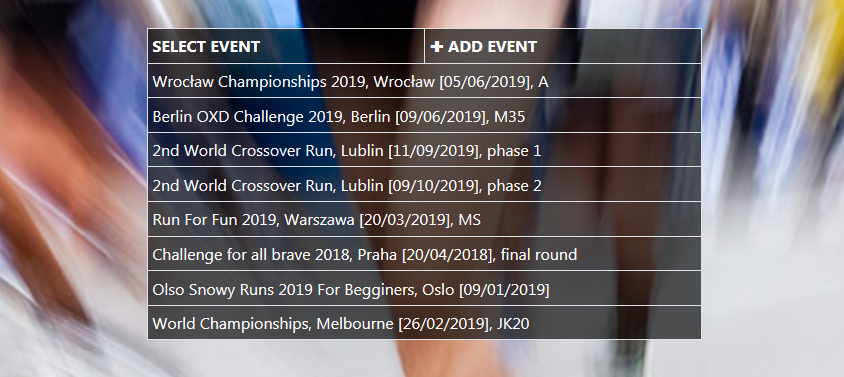
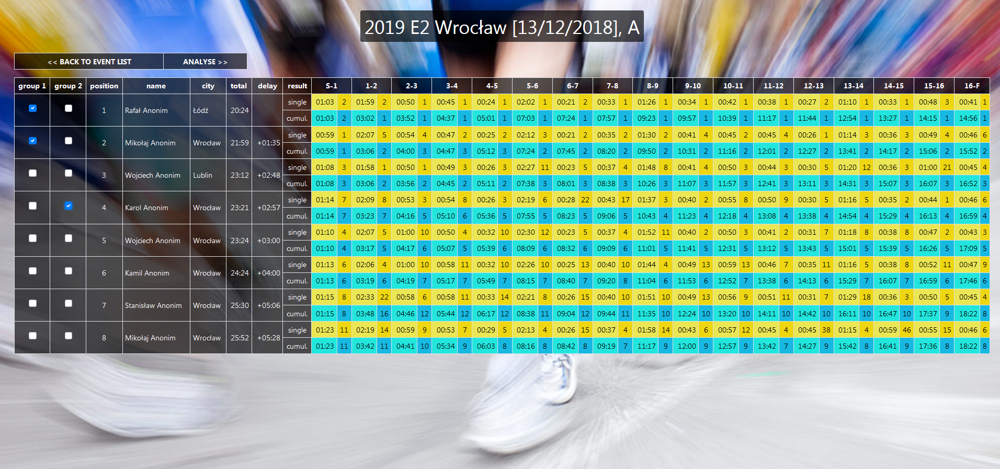
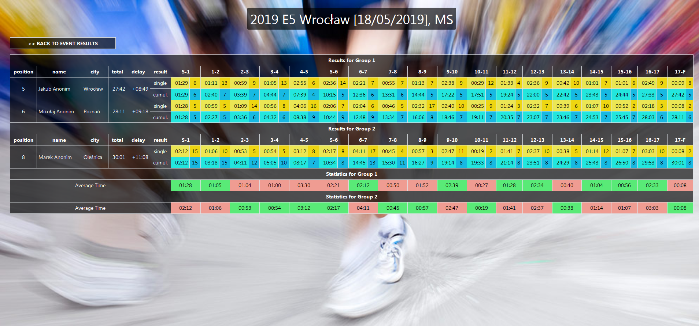
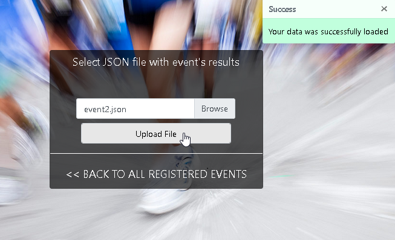
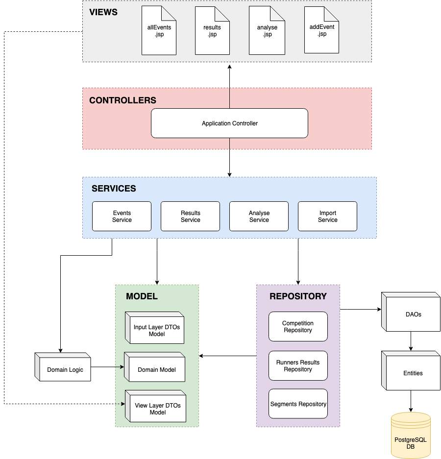

# sportmetrics

Sportmetrics is a tool for tracking and analyse the results of participants in sports competitions.

### Functionality

##### Event list

Main page contains the list of all imported events. It is possible to choose one to look 
at the detailed results or import a new one. 

 

##### Event results

After selecting the event, results for all competitors are shown. The results are sorted by the 
place taken by the player. Total run time is presented as well as delay to the winner.

Usually times are caught several times during a run. Each measurement determines a separate run segment.
It allow to track runners pace on various sections of the route. Each segment result includes:
- single time achieved in the current segment
- position achieved only within the current segment compared to other competitors
- cumulative time achieved from the beginning of the run until the end of the current segment
- position hold at the end of the current segment

 

The application enables to select specific competitors for further analysis. It is possible to join any runner 
into one of two separate groups depending on what needs to be studied.

##### Analysis

The competitors are divided into two groups. For example one group can contain examined runner and second can be 
composed of competitors which was better than examined. It's useful to check which segments were significant that the
runner was beaten by others. This information can be combined with segments characteristic, and from this can be drawn 
conclusion about the specific weakness of the runner.  

Currently groups are compared using below statistics:
- Average of single times achieved by group in the current segment
- Median of single times achieved by group in the current segment 

Green colour means result better than other group, pink means worse and grey is draw. 

 

##### Event import

Importing a new event is possible under condition the input file has the expected format. 
The file should be in json format:

		{
		"name" : "Any event desctiption",
		"segments" : [
			"S-1",
			"1-2"
		],
		"results" : [
			{
				"position" : 1,
				"competitor" : "Competitor name",
				"city" : "Competitor city",
				"total" : "20.24",
				"delay" : "+0.00",
				"segmentResults" : [
					{
						"time" : "1.03",
						"position" : 2
					},
					{
						"time" : "1.59",
						"position" : 2
					}
				],
				"cumulativeResults" : [
					{
						"time" : "1.03",
						"position" : 2
					},
					{
						"time" : "3.02",
						"position" : 1
					}
				]
			},
			{
				"position" : 2,
	. . . . . . . . . . . . . . . . . . . . . . . . . . . 
			}
		]
		}

Example files can be found in application resources.

After successful import event is visible on event list.

 

### Application architecture

sportsmetrics is a MVC Java Spring Boot application. Data persistence layer is based on jpa (Hibernate) and PostgreSQL.
Application frontend is built on JSP with Bootstrap support. 

### Application setup 

Minimum Java version is 8. 

Before application launch PostgreSQL server should be setup.
It is required to have separated database with name "sportmetrics". It is recommended
to create new user/role for this application. From default it's name and pass is springapp,
however it can be configured by application.properties. This role should be an owner of sportmetrics 
db. Db scheme will be created by jpa automatically with first run.

Application is built to the war archive which can be easily deployed in a standard way. 

For development purposes it is recommended to configure development environment as Spring Boot App.
However as maven project it can be easy build to war archive and independently deployed as JAR application.